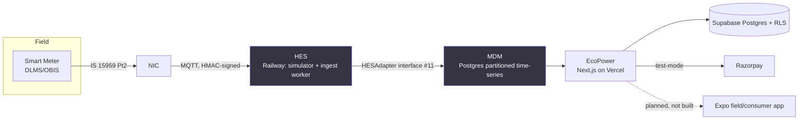

# Architecture & SPOF diagram

Closing-slide pair for the pitch: what the system actually is, then the same
picture with every single point of failure named and its remediation stated.
See [HANDOFF.md](../HANDOFF.md) for what's real vs. scaffolding as of this
writing — this doc reflects that, not the aspirational README table.

## 1. Data flow — Meter → NIC → HES → MDM → EcoPower

**`HESAdapter` boundary (#11):** today the HES side is our own simulator
publishing physically-modelled readings over MQTT. Production swaps that one
adapter for a real head-end system (e.g. Trilliant UnitySuite) — the MDM side
(ingest worker, schema, RLS, billing) doesn't change.

**Runtime homes:**

| Component | Runs on | Status |
|---|---|---|
| Next.js app (7 role panels) | Vercel | real, deployed |
| Postgres + RLS + pg_cron | Supabase | real |
| MQTT broker + simulator + ingest worker | Railway | real, persistent Node processes |
| Razorpay payments | Razorpay (test mode) | real |
| Mobile (consumer/field) | Expo/EAS | not built |
| ML services (forecasting, anomaly, OCR) | — | not built |

## 2. Single points of failure

| SPOF | Failure mode | Remediation (stated, not built) |
|---|---|---|
| Railway MQTT broker + ingest worker | Broker or worker process dies → readings queue at the NIC and stop landing until restart | Managed MQTT cluster (HiveMQ Cloud / EMQX) with multiple ingest worker replicas behind a shared subscription; PK + `ON CONFLICT DO NOTHING` on ingest means a restart loses nothing already delivered — see #15 |
| Supabase Postgres (single project) | Single region, single primary — an outage takes down every panel and the ingest write path | Read replicas for panel queries; point-in-time recovery is already on by default on Supabase Pro; multi-region is future work, not present |
| Vercel deployment (single region by default) | Regional Vercel outage takes the web app down for all five roles | Vercel's edge network already mitigates most of this; multi-region functions would be the next step if traffic demanded it |
| Razorpay webhook endpoint | If `/api/webhooks/razorpay` is down when Razorpay retries, a payment confirmation could be missed | Razorpay retries webhooks with backoff; `webhook_events.event_id UNIQUE` + reconciliation screen (#41) catches anything missed on manual re-fetch |

Honesty about these reads as senior — a diagram with no SPOFs reads as naive.
Pairs with the ingest idempotency argument (#15): a worker crash loses no data,
which is the substantive basis for any uptime claim, not a hopeful number.

## 3. Five problem statements, one build

| PS | Covered by | Status |
|---|---|---|
| 1. Energy as a Service | the platform (billing, subscriptions, DISCOM panel) | shipped |
| 2. Smart Metering Super App for consumers | Expo consumer app (#43, #18) | not built |
| 3. Predictive Maintenance of Meters | anomaly detection (#54, #27) | #27 shipped, #54 not built |
| 4. Meter reading via OCR from field photographs | #47, #46, #37 | not built |
| 5. Real-time asset tracking | #45, #48, asset registry | not built |

The competition is scoped to **PS1 only** for this team — see #91. This table
exists for Q&A, not as a claim that PS2–5 are complete.
